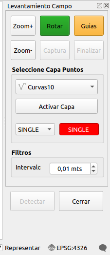
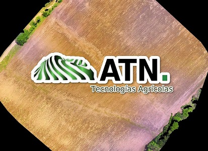

# QGIS PLUGIN NAVI SURVEY RTK 1.0 

Navi Survey_RTK es un desarrollo de Qgis plugin para facilitar la navegacion en campo y recoleccion de puntos para estudios posteriores, cuando usamos nuestro dispositivo en conjunto con un sistema RTK o GNSS normal

  

La herramienta tiene como principales funciones facilitar la captuda de puntos en campo en tiempo real.
Los puntos son almacenados de forma dinamica en una capa previamente definida y de acuerdo a parametros de calidad establecidos.
Estos son usados para posteriones generaciones de Modelos de Elevacion de los terremos analizados para poder establecer curvas a nivel para sistemas de riego por gravedad
  
  
 
Para modelos que cuenten con presicion aceptable, es necesario contar con sistemas RTK
  
La herramienta esta en desarrollo y se invita a participar a cualquier entusiasta del tema

  

Para su instalacion en qgis, solo es necesario copiar el repositorio en la direccion para plugin establecida por QGIS

En Windown:

	C:\Users\username\AppData\Roaming\QGIS\QGIS3\profiles\default\python\plugins\

En Linux:

	/home/username/.local/share/QGIS/QGIS3/profiles/default/python/plugins/

- [x] Configurar acceso a informacion GPS
- [x] Filtro de calidad de puntos
- [ ] Pruebas de Campo
- [x] Rotacion de mapa en tiempo real
- [ ] Calculo de area
- [x] Implementar guia visual de recorrido

### Version Control

- 1.0

